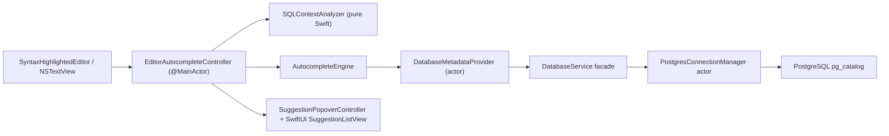

# SQL Autocomplete Architecture and Implementation Plan

## Scope

This document maps the proposed SQL contextual autocomplete feature onto the current PostgresGUI codebase. It is intentionally implementation-oriented: it identifies what already exists, what should be added, where the seams are, and which design decisions should change from the original brief to better fit this repository.

## Current Repository Baseline

PostgresGUI already has the main primitives needed for a lightweight native autocomplete system:

- `PostgresGUI/Views/Primitives/SyntaxHighlightedEditor.swift` already wraps `NSTextView` inside `NSViewRepresentable`, owns the `NSTextViewDelegate`, and already debounces editor work for syntax highlighting.
- `PostgresGUI/Services/Postgres/PostgresConnectionManager.swift` is already an `actor` with reconnect and `withConnection` support, which is the correct concurrency boundary for metadata fetches.
- `PostgresGUI/Services/DatabaseService.swift` is already the façade used by UI code and should stay the single entry point for database-facing operations.
- `PostgresGUI/State/ConnectionState.swift` already caches table metadata for the sidebar and row editing flow, but that cache is selection-oriented and not suitable as the autocomplete source of truth.
- `PostgresGUI/Utilities/QueryTypeDetector.swift` and `PostgresGUI/Utilities/SQLStatementSplitter.swift` show the existing style for pure-Swift SQL utilities with tests under `PostgresGUITests`.
- `PostgresGUITests` uses the `Testing` framework, not `XCTest`. New parser/ranker tests should follow that pattern.

## Gap Analysis

The current codebase has four concrete gaps relative to contextual SQL autocomplete:

| Area | Current state | Problem for autocomplete |
| --- | --- | --- |
| Editor interaction | `SyntaxHighlightedEditor` only surfaces text changes through the binding | No caret geometry, selected range, or selection-change callback for positioning and context resolution |
| Metadata source | `MetadataService` and `TableMetadataService` are `@MainActor` and table-focused | Hot-path autocomplete cannot depend on UI-oriented, main-actor metadata calls |
| Catalog coverage | `fetchColumns` uses `information_schema.columns`; `fetchTables` is table-centric and misses view/materialized-view detail | Too slow and incomplete for low-latency editor suggestions |
| Keyboard routing | Editor currently lets `NSTextView` own arrows, return, tab, and escape | Suggestion overlay cannot become first-class keyboard UI without an AppKit interception layer |

## Architectural Decisions

### 1. Add a dedicated autocomplete subsystem

Do not extend `TableMetadataService` to serve editor suggestions. Its current responsibility is "selected table metadata for browse/edit flows", not "global, low-latency catalog cache". Mixing them would couple editor behavior to sidebar selection and create avoidable invalidation bugs.

Recommended split:

- Keep `TableMetadataService` for row-edit and selected-table workflows.
- Add a dedicated autocomplete metadata pipeline with its own sendable models and cache lifecycle.

### 2. Keep the keystroke path memory-only

The per-keystroke path must never hit PostgreSQL directly. The only database work should be:

- Initial warm-up after a connection becomes active.
- Explicit refresh after schema changes.
- Optional lazy fetch when the user references a schema that was not preloaded.

Everything else should happen in memory:

- Determine current statement.
- Determine current token and caret range.
- Resolve context.
- Resolve aliases.
- Rank candidates.

### 3. Reuse the existing connection stack

Do not create a second PostgreSQL connection just for autocomplete. Reuse the existing `DatabaseService -> ConnectionManagerProtocol -> PostgresConnectionManager` chain. This keeps Keychain, TLS, reconnect behavior, and failure semantics centralized.

### 4. Prefer `NSTextView` subclass command routing over a global event monitor

The original brief suggested `NSEvent.addLocalMonitorForEvents`. In this repository, a cleaner and less fragile approach is to subclass `NSTextView` and intercept:

- `moveUp(_:)`
- `moveDown(_:)`
- `insertNewline(_:)`
- `insertTab(_:)`
- `cancelOperation(_:)`

This keeps keyboard routing local to the editor instance and avoids swallowing unrelated key events elsewhere in the window.

Use a local event monitor only as a fallback if command routing proves insufficient for a specific edge case.

### 5. Use `pg_catalog`, not `information_schema`, for the autocomplete cache

The autocomplete metadata query should be a dedicated catalog query joining:

- `pg_namespace`
- `pg_class`
- `pg_attribute`
- optionally `pg_type`

That query should return schemas, relations, relation kind, column names, data types, and relation OIDs in one pass. This avoids repeated per-table metadata requests and reduces latency significantly on large databases.

## Proposed Target Design



## Proposed Components and File Layout

These names are intentionally aligned with the existing folder conventions. Exact names can change, but the boundary should remain.

| Proposed file | Responsibility |
| --- | --- |
| `PostgresGUI/Models/AutocompleteCatalog.swift` | Sendable models for schema/relation/column snapshots used only by autocomplete |
| `PostgresGUI/Models/SuggestionItem.swift` | UI-facing suggestion rows with title, subtitle, kind, and insertion text |
| `PostgresGUI/Services/Protocols/AutocompleteCatalogServiceProtocol.swift` | Narrow contract for fetching catalog snapshots |
| `PostgresGUI/Services/AutocompleteCatalogService.swift` | Database-facing service that runs the catalog query through the existing connection stack |
| `PostgresGUI/Services/DatabaseMetadataProvider.swift` | `actor` cache for in-memory schema lookup and invalidation |
| `PostgresGUI/Services/AutocompleteEngine.swift` | Ranking/filtering engine that turns context + token into `SuggestionItem` values |
| `PostgresGUI/Utilities/SQLContextAnalyzer.swift` | Backward scanner, alias resolver, current token extraction, and statement scoping |
| `PostgresGUI/ViewModels/EditorAutocompleteController.swift` | Main-actor bridge between AppKit editor events and async suggestion loading |
| `PostgresGUI/Views/Primitives/AutocompleteTextView.swift` | `NSTextView` subclass for keyboard interception and caret geometry |
| `PostgresGUI/Views/Components/Content/SuggestionListView.swift` | SwiftUI suggestion list rendered inside a popover or lightweight overlay |

## Data Model Recommendations

Do not reuse `TableInfo` and `ColumnInfo` as the cache models for autocomplete.

Reasons:

- They are UI-oriented.
- They are not currently marked `Sendable`.
- `TableInfo` does not represent views or materialized views cleanly.
- `ColumnInfo` includes edit-oriented flags that are irrelevant to autocomplete ranking.

Recommended autocomplete models:

```swift
struct DBRelationSummary: Sendable, Hashable, Codable {
    let oid: Int64
    let schema: String
    let name: String
    let kind: RelationKind
}

struct DBColumnSummary: Sendable, Hashable, Codable {
    let relationOid: Int64
    let relationSchema: String
    let relationName: String
    let name: String
    let dataType: String
    let ordinalPosition: Int
}

enum RelationKind: String, Sendable, Codable {
    case table
    case view
    case materializedView
    case foreignTable
}
```

## Metadata Layer Design

### Recommended query shape

The initial snapshot should come from a single query against `pg_catalog`, filtered to non-system schemas by default. The snapshot should include:

- schema name
- relation name
- relation kind
- relation OID
- column name
- column data type
- ordinal position

Recommended behavior:

- Warm only `public` plus schemas in `search_path` on connect.
- Allow optional lazy fetch for additional schemas when the user types `schema_name.`.
- Keep a timestamp or generation token on the cache.

### Why a dedicated `DatabaseMetadataProvider` actor is necessary

This actor should own:

- the latest relation dictionary
- relation-oid to columns mapping
- schema to relation mapping
- invalidation generation
- an in-flight refresh task to deduplicate repeated refreshes

This actor should not own UI state and should not know anything about `NSTextView`.

### Refresh triggers

Refresh should occur when:

- a connection becomes active
- the selected database changes
- a schema-modifying query succeeds
- the user explicitly refreshes metadata in the future

Refresh should not occur on every `SELECT`, `INSERT`, `UPDATE`, or `DELETE`.

## Parser and Context Design

### Statement scoping

Autocomplete should analyze the active statement, not the entire editor content. Reuse the ideas from `SQLStatementSplitter`, but add a helper that returns the statement containing the current caret.

This is important because:

- the editor can contain multiple statements
- alias resolution should not leak across statements
- ranking should consider only the local query block

### Context states

The original context taxonomy is valid with minor repository-specific adjustments:

- `.tablesAndSchemas`
- `.columnsGlobal`
- `.columnsSpecific(alias: String)`
- `.keywords`
- `.none`

### Parsing strategy

Use a pure-Swift lexical scanner with these rules:

- scan backward from the caret to find the current token and nearest structural keyword
- skip whitespace, comments, and quoted strings when looking for structural pivots
- treat `FROM`, `JOIN`, `INTO`, `UPDATE`, and `DELETE FROM` as relation contexts
- treat `SELECT`, `WHERE`, `ON`, `GROUP BY`, `ORDER BY`, and `HAVING` as column contexts
- when the active token follows `.`, resolve either `alias.column` or `schema.table`

### Alias resolution

Use a forward scan limited to the active statement and current nesting level. Start with:

- `FROM users u`
- `FROM users AS u`
- `JOIN orders o`
- `JOIN public.orders AS o`

Do not try to solve every SQL grammar form in phase 1. Handle the common cases first, then add fixtures for more advanced queries:

- nested subqueries
- CTE names
- quoted identifiers
- repeated aliases across nested scopes

## Ranking and Suggestion Design

Start with a deterministic, fast ranking model:

1. Exact case-insensitive prefix match
2. Case-insensitive substring match
3. Lightweight subsequence match
4. Stable alphabetical tie-breaker

Do not start with a heavy fuzzy scorer. The dataset is relatively small per context, and a simple deterministic ranker is easier to reason about and test.

Suggestion rows should include:

- `title`: visible identifier
- `subtitle`: data type or relation kind
- `kind`: table, view, schema, or column
- `insertionText`: what gets written to the editor

## Editor Integration Plan

### Recommended change to `SyntaxHighlightedEditor`

`SyntaxHighlightedEditor` is the best integration point because it already owns:

- `NSTextView`
- delegate callbacks
- selection restoration
- editor-local debouncing

Recommended change:

- replace the internal `NSTextView()` construction with `AutocompleteTextView()`
- give the coordinator an `EditorAutocompleteController`
- trigger autocomplete reevaluation from both `textDidChange` and `textViewDidChangeSelection`

### Caret geometry

The editor layer should expose:

- current selected range
- current word range
- caret rect in view coordinates

Use `layoutManager`, `textContainer`, and the insertion glyph range to compute the on-screen rect. This is already consistent with how `LineNumberRulerView` uses TextKit primitives in this repository.

### Overlay strategy

Use one of these, in order of preference:

1. `NSPopover` anchored to the caret rect
2. A small borderless child window if popover behavior becomes unstable during rapid typing

The content should be SwiftUI, embedded through `NSHostingController`, to stay consistent with the rest of the app.

## Integration With Existing State and Services

### `QueryEditorViewModel`

Keep query execution and autosave in `QueryEditorViewModel`. Do not move autocomplete ranking into this view model directly.

Recommended additions:

- own an `EditorAutocompleteController`
- trigger metadata warm-up when the editor appears and a database is already selected
- trigger metadata refresh after successful schema-changing queries

### `DatabaseService`

Add a narrow autocomplete-specific API rather than exposing raw connections to UI code. Example:

```swift
func fetchAutocompleteCatalog(targetSchemas: Set<String>?) async throws -> AutocompleteCatalogSnapshot
```

This keeps connection ownership inside the service layer while allowing the cache actor to stay decoupled from the UI.

### `ConnectionState`

Do not reuse `tableMetadataCache` as the autocomplete cache. The semantics are different:

- `tableMetadataCache` is keyed by selected table and optimized to avoid list rerenders
- autocomplete needs global schema lookup independent of sidebar selection

The only connection-state coupling needed is:

- clear autocomplete state on disconnect
- warm metadata when a new database becomes active

## Performance and Memory Controls

Recommended guardrails for phase 1:

- cap warm-up to `public` plus `search_path`
- keep suggestions capped to 100 items per request
- avoid storing duplicate strings when possible by grouping columns under relation OID
- ignore system schemas unless explicitly requested
- debounce suggestion computation separately from syntax highlighting

If production catalogs prove large, phase 2 optimizations can add:

- schema-level lazy loading
- LRU eviction for rarely used schema snapshots
- per-schema generations instead of full-cache replacement

## Testing Plan

Use the existing `Testing` framework under `PostgresGUITests`.

Add pure unit suites first:

- `SQLContextAnalyzerTests`
- `AutocompleteEngineTests`
- `AutocompleteCatalogMergeTests`
- `ActiveStatementResolverTests`

Representative scenarios:

- `SELECT * FROM ` suggests tables
- `SELECT u.` suggests columns for alias `u`
- `SELECT * FROM public.` suggests relations in `public`
- `WITH recent AS (...) SELECT r.` resolves CTE aliases after phase 2 support lands
- quoted identifiers with spaces
- multi-statement editors where only the active statement is analyzed
- incomplete SQL with trailing commas, open parentheses, or partial tokens

UI coverage can then be added in `PostgresGUIUITests` for:

- popover opening near the caret
- arrow-key navigation
- return/tab insertion
- escape dismissal

## Phased Delivery Plan

### Phase 1: Catalog and cache foundation

- Add autocomplete-specific models.
- Add `fetchAutocompleteCatalog` to the service layer.
- Implement `DatabaseMetadataProvider` actor.
- Warm metadata on editor appear or connection activation.

Exit criteria:

- in-memory lookup returns relations and columns without hitting the database during typing
- refresh after reconnect works

### Phase 2: Parser and ranker

- Implement active-statement extraction.
- Implement backward scanning and alias mapping.
- Implement deterministic ranking.
- Add full unit coverage for parser edge cases.

Exit criteria:

- context resolution is stable for common `SELECT`, `JOIN`, `WHERE`, and `UPDATE` statements

### Phase 3: AppKit bridge and suggestion UI

- Add `AutocompleteTextView`.
- Add caret rect calculation.
- Add `EditorAutocompleteController`.
- Add SwiftUI suggestion list and insertion behavior.

Exit criteria:

- suggestions appear at the caret
- keyboard navigation works without breaking normal editor behavior

### Phase 4: Invalidations and polish

- Refresh metadata after DDL success.
- Support schema-qualified completion and more alias forms.
- Add empty-state behavior, loading-state behavior, and error fallback.

Exit criteria:

- autocomplete stays in sync after `CREATE TABLE`, `ALTER TABLE`, and `DROP VIEW`

## Repo-Tailored Prompt Pack

These prompts are safer than the original generic versions because they constrain the generated code to this repository's architecture.

### Prompt 1: Catalog fetch and metadata cache

Use this when generating the metadata foundation:

```text
You are implementing SQL autocomplete for PostgresGUI, a native macOS PostgreSQL client written in Swift.

Repository constraints:
- Reuse DatabaseService and the existing ConnectionManagerProtocol / PostgresConnectionManager stack.
- Do not open a second database connection.
- Do not use information_schema for the autocomplete hot path.
- New autocomplete cache models must be Sendable and separate from TableInfo / ColumnInfo.
- The codebase uses Swift concurrency and pure Swift utility types.

Task:
- Add an autocomplete-specific catalog fetch path that queries pg_catalog for schemas, relations, relation OIDs, relation kinds, columns, and data types.
- Implement an actor named DatabaseMetadataProvider that stores the catalog in dictionaries optimized for O(1) lookup.
- Support refresh and clear operations.

Testing constraints:
- Add tests using the Testing framework already used in PostgresGUITests.
```

### Prompt 2: SQL context analyzer

Use this when generating the parser:

```text
You are adding a pure Swift SQL context analyzer to PostgresGUI.

Repository constraints:
- Follow the style of QueryTypeDetector and SQLStatementSplitter.
- Tests must use the Testing framework, not XCTest.
- The analyzer must work on incomplete SQL and must never crash on String.Index handling.
- Analyze only the active statement around the caret, not the entire editor buffer.

Task:
- Implement SQLContextAnalyzer with backward scanning, current-token extraction, and alias resolution.
- Support tables/schemas, global columns, alias-specific columns, keywords, and none.
- Keep the implementation dependency-free and optimized for frequent invocation.
```

### Prompt 3: Ranking engine

Use this when generating the engine:

```text
You are implementing the deterministic ranking engine for SQL autocomplete in PostgresGUI.

Repository constraints:
- Input data comes from DatabaseMetadataProvider.
- Output must be SuggestionItem values suitable for SwiftUI/AppKit rendering.
- Favor deterministic prefix and substring ranking over heavyweight fuzzy matching.
- Keep the per-keystroke path memory-only.

Task:
- Implement AutocompleteEngine that filters and ranks tables, schemas, views, and columns based on context and current token.
- Keep result limits reasonable and preserve stable ordering for equal scores.
- Add focused tests for prefix, substring, and alias-based column resolution.
```

### Prompt 4: AppKit editor bridge

Use this when generating the UI bridge:

```text
You are integrating SQL autocomplete into PostgresGUI's existing SyntaxHighlightedEditor.

Repository constraints:
- SyntaxHighlightedEditor already wraps NSTextView in NSViewRepresentable.
- Prefer an NSTextView subclass for keyboard routing instead of a global local-event monitor.
- Use SwiftUI for the suggestion list and bridge it through AppKit.
- Do not break existing syntax highlighting, undo, or selection restoration behavior.

Task:
- Add AutocompleteTextView, caret-rect calculation, and a controller that requests suggestions asynchronously.
- Show a popover or lightweight overlay near the caret.
- Support up/down navigation, return/tab insertion, and escape dismissal.
```

## Important Deviations From The Original Brief

These changes are recommended because they better fit the current repository:

- Use the `Testing` framework instead of sample `XCTest` extensions.
- Prefer `NSTextView` subclass command routing over a global event monitor.
- Do not reuse `ColumnInfo` and `TableInfo` as sendable autocomplete cache models.
- Do not route frequent suggestion work through `@MainActor` metadata services.
- Limit phase-1 analysis to the active statement and common alias patterns instead of attempting full SQL grammar coverage immediately.

## Recommended First PR Scope

The lowest-risk first implementation should include only the foundation:

- autocomplete catalog models
- service-layer catalog fetch
- metadata cache actor
- parser/ranker utilities with tests

That PR should explicitly exclude the popover UI. It gives the project a correct backend and test surface first, and it keeps AppKit/editor complexity isolated to the next change set.
